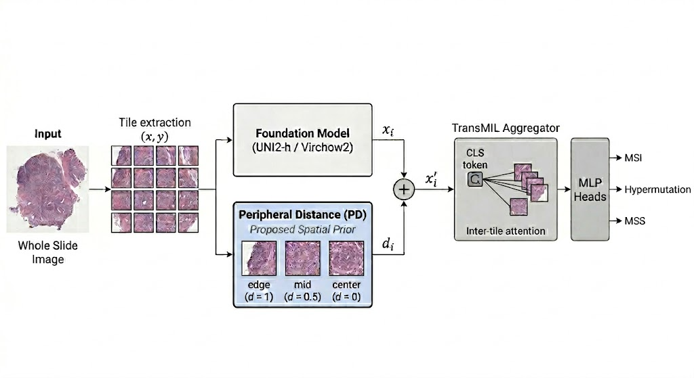
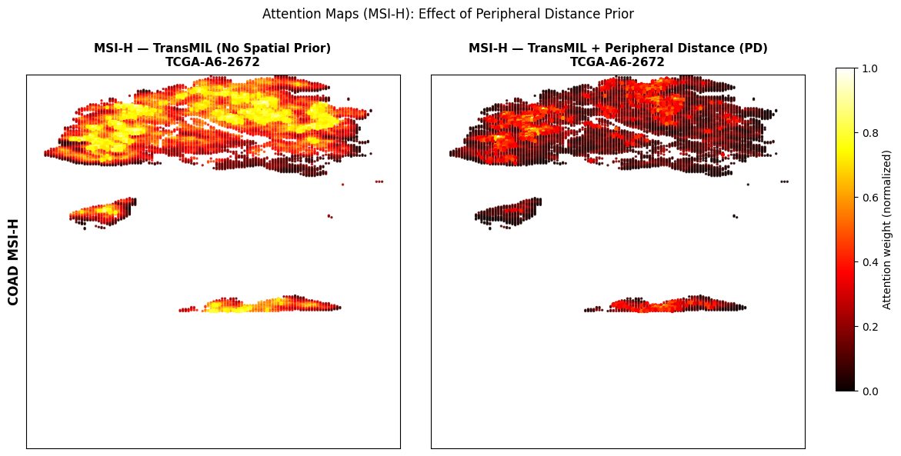
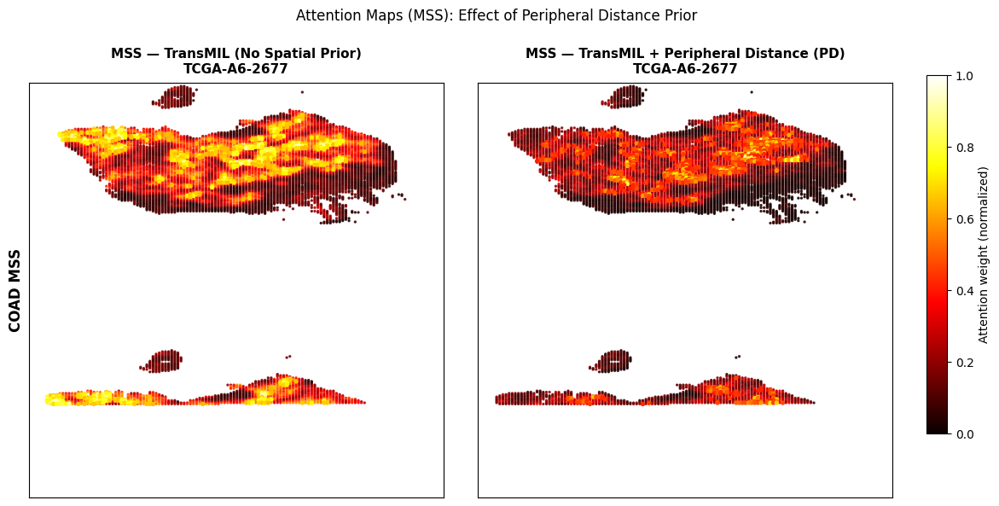

# Biological Spatial Priors Regularize Foundation Model Representations for Cross-Site MSI Generalization in Colorectal Cancer

<p align="center">
  <a href="https://arxiv.org/abs/2605.02660"></a>
  <a href="https://drive.google.com/drive/folders/1Yo6VLX7CuSvStGcXWWIPGweCXAMdDM_e?usp=sharing"></a>
  
  
</p>

<p align="center">
  <b>Dasari Naga Raju</b>
</p>

> **TL;DR** — A single scalar encoding each tile's distance to the slide boundary, injected into TransMIL before self-attention, raises cross-site MSS specificity from 0.939 to **1.000** on an external cohort — zero false positives across 49 MSS cases, no target-domain retraining.

---

## Abstract

Predicting MSI status from routine H&E whole slide images offers a practical alternative to molecular testing, but models trained at one institution fail when applied to slides from a different site. Foundation models encode site-specific staining patterns alongside the real biological signal, causing cross-site specificity to collapse.

We ask a simple question: MSI-H tumors have a well-characterized spatial biology — dense lymphocytic infiltration at the tumor invasive margin, known as the Crohn's-like reaction. This pattern is conserved across institutions and scanners. Can encoding it explicitly as a tile-level prior guide foundation model representations toward more site-invariant features?

We introduce **peripheral distance encoding** — a scalar prior capturing each tile's proximity to the slide boundary — injected into TransMIL before self-attention. We also evaluate a secondary **local immune neighborhood encoding** capturing the lymphocyte-to-tumor ratio in each tile's spatial neighborhood. Training on TCGA-COAD (137 slides) and evaluating on TCGA-READ (50 slides) without any target-domain retraining, peripheral distance encoding raises MSS specificity from 0.939 to **1.000** — zero false positives across all 49 MSS cases.

---

## Method

<p align="center">
  
</p>

*Tile features extracted by UNI2-h or Virchow2 are augmented with the peripheral distance scalar and aggregated using TransMIL for simultaneous MSI, MSS, and hypermutation prediction. The peripheral distance prior encodes each tile's proximity to the slide boundary as a geometric proxy for the tumor invasive margin — where the Crohn's-like lymphocytic reaction is spatially concentrated in MSI-H tissue.*

---

## Results

### Table 1 — Baseline Configurations

| Encoder | Aggregator | COAD MSI AUC | Hyper AUC | READ MSS Spec |
|---------|-----------|:------------:|:---------:|:-------------:|
| UNI2-h | ABMIL | 0.948 ± 0.028 | 0.903 ± 0.049 | 0.796 |
| UNI2-h | CLAM-SB | 0.935 ± 0.042 | 0.897 ± 0.054 | 0.837 |
| UNI2-h | TransMIL | 0.957 ± 0.013 | 0.902 ± 0.075 | 0.939 |
| Virchow2 | ABMIL | 0.934 ± 0.044 | 0.881 ± 0.045 | 0.408 |
| Virchow2 | CLAM-SB | 0.929 ± 0.053 | 0.868 ± 0.065 | 0.939 |
| Virchow2 | TransMIL | 0.915 ± 0.037 | 0.865 ± 0.079 | 0.878 |
| Kather et al. (2019) | ResNet | 0.840 | — | — |

### Table 2 — With Biological Spatial Priors

| Encoder | Configuration | COAD MSI AUC | Hyper AUC | READ MSS Spec |
|---------|--------------|:------------:|:---------:|:-------------:|
| UNI2-h | TransMIL | 0.957 ± 0.013 | 0.902 ± 0.075 | 0.939 |
| UNI2-h | **TransMIL + PD** | **0.959 ± 0.012** | 0.808 ± 0.121 | **1.000** |
| UNI2-h | TransMIL + LIN | 0.953 ± 0.022 | 0.881 ± 0.068 | 0.939 |
| Virchow2 | TransMIL | 0.915 ± 0.037 | 0.865 ± 0.079 | 0.878 |
| Virchow2 | TransMIL + PD | 0.941 ± 0.036 | 0.863 ± 0.079 | 0.959 |
| Virchow2 | TransMIL + LIN | 0.905 ± 0.047 | 0.876 ± 0.045 | 0.959 |

> **PD** = Peripheral Distance encoding | **LIN** = Local Immune Neighborhood encoding
>
> Training: TCGA-COAD (137 slides, 5-fold CV) | External validation: TCGA-READ (50 slides, no target-domain retraining)

---

## Attention Maps

The figures below show how peripheral distance encoding shifts model attention toward the tumor invasive margin in MSI-H slides, while producing diffuse suppression in MSS slides — consistent with a biologically informed inductive bias rather than a generic boundary detector.

<p align="center">
  
</p>

*MSI-H slide (TCGA-A6-2672). Left: baseline TransMIL distributes attention broadly across the tissue interior. Right: TransMIL + PD concentrates attention toward the tissue boundary, spatially concordant with the Crohn's-like reaction at the invasive margin.*

<p align="center">
  
</p>

*MSS slide (TCGA-A6-2677). Both configurations produce diffuse attention with no peripheral concentration, consistent with the absence of peritumoral immune infiltrate in microsatellite stable tumors.*

---

## Repository Structure

```
peripheral-distance-msi/
│
├── priors/
│   ├── peripheral_distance.py        # PD encoding — core contribution
│   └── local_immune_neighborhood.py  # LIN encoding
│
├── models/
│   ├── abmil.py                      # ABMIL (Table 1, Rows 1 & 4)
│   ├── clam.py                       # CLAM-SB (Table 1, Rows 2 & 5)
│   └── transmil.py                   # TransMIL baseline (Table 1, Rows 3 & 6)
│
├── baselines/
│   └── train_baselines.py            # All 6 baseline configurations
│
├── train.py                          # TransMIL + PD training (main result)
├── evaluate_read.py                  # Cross-site evaluation on TCGA-READ
├── attention_maps.py                 # Attention map visualization
├── peripheral_distance.py            # PD encoding (standalone)
├── transmil_pd.py                    # TransMIL + PD model (standalone)
├── X.png                             # Architecture diagram
├── X2.png                            # Attention maps — MSI-H
├── X3.png                            # Attention maps — MSS
└── requirements.txt
```

---

## Data and Pretrained Models

All embeddings, labels, and trained model checkpoints are publicly available:

**[Google Drive — Embeddings, Labels & Checkpoints](https://drive.google.com/drive/folders/1Yo6VLX7CuSvStGcXWWIPGweCXAMdDM_e?usp=sharing)**

```
TCGA_COAD/
├── embeddings_uni2h_coad/            # UNI2-h features — TCGA-COAD (137 slides)
├── embeddings_uni2h_read/            # UNI2-h features — TCGA-READ (50 slides)
├── embeddings_virchow2_coad/         # Virchow2 features — TCGA-COAD
├── embeddings_virchow2_read/         # Virchow2 features — TCGA-READ
├── embeddings_uni2h_til_coad/        # UNI2-h + LYM scores (for LIN encoding)
├── coad_labels_combined.csv          # TCGA-COAD labels (MSI status, hypermutation)
├── read_labels.csv                   # TCGA-READ labels
├── nct_linear_probe.pth              # NCT-CRC-HE-100K linear probe (for LIN)
└── saved_models_137/
    ├── uni2h_abmil_baseline/         # UNI2-h + ABMIL checkpoints (fold1-5)
    ├── uni2h_clam_baseline/          # UNI2-h + CLAM-SB checkpoints
    ├── uni2h_transmil_baseline_v2/   # UNI2-h + TransMIL baseline checkpoints
    ├── virchow2_abmil_baseline/      # Virchow2 + ABMIL checkpoints
    ├── virchow2_clam_baseline/       # Virchow2 + CLAM-SB checkpoints
    ├── virchow2_transmil_baseline/   # Virchow2 + TransMIL baseline checkpoints
    ├── uni2h_transmil_pd_v4/         # UNI2-h + TransMIL + PD — main result
    ├── uni2h_transmil_lin/           # UNI2-h + TransMIL + LIN
    ├── virchow2_transmil_pd/         # Virchow2 + TransMIL + PD
    └── virchow2_transmil_lin/        # Virchow2 + TransMIL + LIN
```

Each `.pt` embedding file contains:

```python
{
    "features":   torch.Tensor,  # (N, feat_dim) — UNI2-h: 1536 | Virchow2: 2560
    "coords":     torch.Tensor,  # (N, 2) — tile pixel coordinates (x, y)
    "slide_dims": torch.Tensor,  # (2,) — slide width and height in pixels
}
```

---

## Installation

```bash
git clone https://github.com/raajuuu1998/peripheral-distance-msi.git
cd peripheral-distance-msi
pip install -r requirements.txt
```

Update the Google Drive path constants at the top of each script before running.

---

## Usage

```bash
# Train all 6 baselines (Table 1)
python baselines/train_baselines.py --encoder uni2h --aggregator abmil
python baselines/train_baselines.py --encoder uni2h --aggregator clam
python baselines/train_baselines.py --encoder uni2h --aggregator transmil
python baselines/train_baselines.py --encoder virchow2 --aggregator abmil
python baselines/train_baselines.py --encoder virchow2 --aggregator clam
python baselines/train_baselines.py --encoder virchow2 --aggregator transmil

# Train main result — UNI2-h + TransMIL + PD (Table 2)
python train.py

# Cross-site evaluation on TCGA-READ
python evaluate_read.py

# Generate attention map figures
python attention_maps.py
```

---

## Citation

If you find this work useful, please cite:

```bibtex
@article{raju2026biological,
  title   = {Biological Spatial Priors Regularize Foundation Model Representations
             for Cross-Site MSI Generalization in Colorectal Cancer},
  author  = {Dasari Naga Raju},
  journal = {arXiv preprint arXiv:2605.02660},
  year    = {2026}
}
```

---

## Acknowledgements

- [UNI2-h](https://huggingface.co/MahmoodLab/UNI2-h) — MahmoodLab, Harvard Medical School
- [Virchow2](https://huggingface.co/paige-ai/Virchow2) — Paige AI, Memorial Sloan Kettering
- [TransMIL](https://github.com/szc19990412/TransMIL) — Shao et al., NeurIPS 2021
- [CLAM](https://github.com/mahmoodlab/CLAM) — Lu et al., Nature Biomedical Engineering 2021
- TCGA-COAD and TCGA-READ data from [GDC Data Portal](https://portal.gdc.cancer.gov/)
